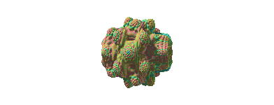

# Fractania-strudel-lite

Live-codable 3D fractals for strudel.cc by Spiraldiver



## Use in strudel.cc

### Mandelbulb

`power` stays at 8 — the classic bulb. The LFO drives `thetashift`, which adds
to the polar angle inside the formula, so the lobes rotate instead of the whole
shape changing order.

The camera sits slightly off-axis and the key light comes from the left, both
by default, so neither needs to be stated in the patch. The geometry is not
rotated — only the viewpoint — so the fractal itself is unchanged.

```js
// Hold Alt + Click to Rotate
await import('https://spiraldiver.github.io/Fractania-strudel-lite/dist/fractania-strudel-lite.js')
samples('github:Spiraldiver/samples_percs')

setcpm(85/4)
let mod = sine.slow(4)

// breakbeat
$: s("crate_bd ~ ~ crate_sd ~ crate_bd ~ crate_sd").cut(1).gain(0.9)
$: s("crate_sh*8").gain("0.2 0.08 0.14 0.08").lpf(6000).cut(2)
$: s("~ ~ crate_hh ~ ~ ~ crate_hh ~").gain(0.16).lpf(7000).cut(2)
$: s("~ ~ ~ ~ ~ ~ crate_oh ~").cut(2).gain(0.26)
$: s("~ crate_rim ~ ~ ~ ~ ~ crate_rim").gain(0.25)

$: s("sawtooth:2!16")
  .note("<0 -12 0 7 0 1 8 0 -12 0 -12 1 0 7 8 -12>*16")
  .scale("e:phrygian")
  .cutoff(mod.range(500, 4695))
  .resonance(8.72)
  .delay(0.383, 0.8296)

fractal("Mandelbulb")
  .power(8)
  .thetashift(mod.range(-0.5, 0.5))
  .iterations(12)
  .bailout(16)
  .fov(45)
  .roughness(0.4).metallic(0.6)
  .out()
```

### Menger

The Dub Example arrangement — four eight-bar sections, drums from the
`samples_percs` crate, and the fractal driven by the same LFO as the arp.

Menger is a fold, not an escape-time formula: it ignores `power` and `bailout`.
Its controls are `mengerscale` (how far each iteration expands, default 3) and
`mengeroffset` (the fold centre, default 1,1,1); `iterations` sets depth.

```js
// Hold Alt + Click to Rotate
await import('https://spiraldiver.github.io/Fractania-strudel-lite/dist/fractania-strudel-lite.js')
samples('github:Spiraldiver/samples_percs')

setcpm(85 / 4)
let mod = sine.slow(4)

const kick = s("crate_bd ~ ~ crate_bd").cut(1).gain(0.9).lpf(800)

const snare = s("~ crate_rim ~ crate_rim").cut(2).gain(0.42).lpf(3000).room(0.2)

const hats = s("crate_sh*8").cut(3)
  .gain("<0.06 0.02 0.05 0.01>").lpf(5500).pan("<0.45 0.55>")

const rarePerc = s("~ crate_perc ~ crate_perc").slow(4).cut(4)
  .gain(0.3).hpf(2800).lpf(9000).delay(0.38).room("1:4")

const skank = note("~ [c4,eb4,g4] ~ [c4,eb4,g4]").s("triangle")
  .gain(0.5).attack(0.01).decay(0.09).sustain(0).release(0.1)
  .lpf(1500).delay(0.18)

const bass = note("c2 c2 ~ eb2 g1 ~ bb1 g1").s("sawtooth")
  .gain(0.48).attack(0.01).release(0.22)
  .lpf(sine.range(130, 320).slow(5))

const organ1 = note("<c3 ~ eb3 ~ g3 ~ eb3 ~>").s("supersaw")
  .gain(0.12).attack(0.02).decay(0.16).sustain(0.12).release(0.25)
  .lpf(1050).delay(0.55).room(0.3)

const organ2 = note("<c3 ~ g3 ~ bb3 ~ eb3 ~>").s("supersaw")
  .gain(0.12).attack(0.02).decay(0.16).sustain(0.12).release(0.25)
  .lpf(1050).delay(0.55).room(0.3)

const organ4 = note("<g3 ~ eb3 ~ bb2 ~ c3 ~>").s("supersaw")
  .gain(0.12).attack(0.02).decay(0.16).sustain(0.12).release(0.25)
  .lpf(1050).delay(0.55).room(0.3)

// arp
const arp = note("c5 eb5 g5 bb5 g5 eb5 d5 f5 ab5 c6 ab5 f5 eb5 g5 bb5 d6")
  .s("triangle")
  .gain("<0.07 0.1 0.06 0.12>")
  .attack(0.005).decay(0.06).sustain(0).release(0.09)
  .lpf(sine.range(700, 2600).slow(4))
  .delay(0.45).room(0.35)

const arp2 = note("c5 g5 eb5 bb5 d5 f5 ab5 c6 bb5 g5 eb5 d5 f5 ab5 c6 d6")
  .s("triangle")
  .gain("<0.07 0.1 0.06 0.12>")
  .attack(0.005).decay(0.06).sustain(0).release(0.09)
  .lpf(sine.range(700, 2600).slow(4))
  .delay(0.45).room(0.35)

const arp3 = note("eb5 g5 bb5 c6 bb5 g5 f5 d5 c5 eb5 g5 ab5 c6 ab5 f5 d5")
  .s("triangle")
  .gain("<0.07 0.1 0.06 0.12>")
  .attack(0.005).decay(0.06).sustain(0).release(0.09)
  .lpf(sine.range(700, 2600).slow(4))
  .delay(0.45).room(0.35)

const arp4 = note("d6 bb5 g5 eb5 c6 ab5 f5 d5 c5 eb5 g5 bb5 ab5 f5 eb5 c5")
  .s("triangle")
  .gain("<0.07 0.1 0.06 0.12>")
  .attack(0.005).decay(0.06).sustain(0).release(0.09)
  .lpf(sine.range(700, 2600).slow(4))
  .delay(0.45).room(0.35)

$: arrange(
  [8, stack(snare, hats, skank, organ1, arp,  rarePerc)],
  [8, stack(kick, snare, skank, bass, organ2, arp2)],
  [8, stack(kick, snare, hats, skank, bass,   arp3, rarePerc)],
  [8, stack(kick, hats, skank, bass, organ4,  arp4)]
).gain(0.85)

fractal("Menger")
  .mengerscale(mod.range(2.6, 3.4))
  .mengeroffset(1, 1, 1)
  .iterations(6)
  .fov(50)
  .orbit(0.08)
  .roughness(0.7).metallic(0.2)
  .out()
```

Keep Menger `iterations` low — the sponge converges after 5-7 levels and each
one costs a full fold per ray step.

---

> **Single quotes matter.** Strudel's transpiler rewrites every double-quoted
> string into mini-notation, and a URL is not valid mini-notation, so
> `import("https://…")` fails with `[mini] parse error … but "/" found`.

Mirror:

```js
await import('https://cdn.jsdelivr.net/gh/Spiraldiver/Fractania-strudel-lite@main/dist/fractania-strudel-lite.js')
```

> jsDelivr caches `@main` hard and can serve a stale build for hours — GitHub
> Pages is always fresh, and with jsDelivr you should pin a tag.

The module boots itself on import, so no `initFractania()` call is needed.
`clearFractania()` stops and removes the canvas. **Alt+drag** orbits the camera.

## Fractals

Selected by name — `fractal("Mandelbulb")`, `fractal("Menger")`. Mini-notation
switches them per cycle: `fractal("<Mandelbulb Menger>")`.

## Commands

Every numeric argument accepts a number, a function `(t) => n`, or a Strudel
pattern/signal.

- **Core** — `.power` `.iterations` `.bailout` `.thetashift` `.phishift` `.offset(x,y,z)` `.scale` `.zradius` `.rotate(x,y,z)` `.prerotate(x,y,z)` `.translate(x,y,z)`
- **Menger only** — `.mengerscale` `.mengeroffset(x,y,z)` — `.power` and `.bailout` do nothing on this variant
- **Camera** — `.camera(x,y,z)` `.camrot(x,y,z)` `.fov` `.zoom` `.orbit(speed)` `.dof(aperture,focal)`
- **Shading** — `.metallic` `.roughness` `.reflection` `.light(x,y,z)`
- **Color** — `.color(r,g,b[,r2,g2,b2])` `.hue` `.glow(strength,threshold)` `.glowcolor(r,g,b)` `.background(r,g,b)`
- **Render** — `.render('basic'|'pbr')` `.resolution(w,h)` `.steps` `.epsilon` `.maxdist`
- **Transforms** — `.lowres(scale,blend)` `.wobble(amp,freq,phase,gain)`
- **Folds** — `.boxfold(limit,blend)`
- **Post** — `.feedback(v)` `.chromatic(v)` `.speed(v)` `.out()`
- **Helpers** — `F(pattern)` · `pattern.map(inMin,inMax,outMin,outMax)` · `initFractania({pixelRatio,fps})` · `clearFractania()`

## License

AGPL-3.0-only.
